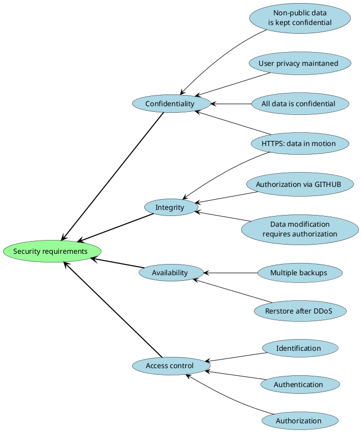
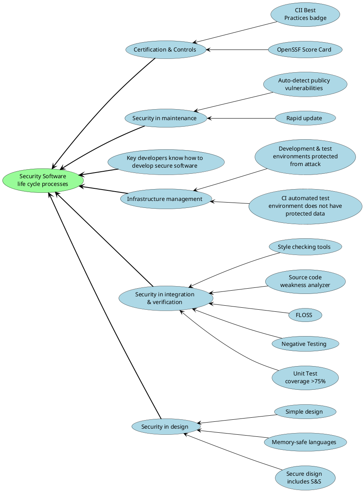

# Security Policy

## Table of Contents
1. [Introduction](#1-introduction)
2. [Vulnerabilities](#2-vulnerabilities)  
    2.1 [Supported Versions](#21-supported-versions)  
    2.2 [Private Vulnerability Reporting](#22-private-vulnerability-reporting)  
    2.3 [Public Vulnerability Reporting](#23-public-vulnerability-reporting)  
    2.4 [Security Disclosure](#24-security-disclosure)  
3. [Security requirements](#3-security-requirements)  
4. [Security Software life cycle processes](#4-security-software-life-cycle-processes)

## 1. Introduction

This document outlines the procedures for addressing vulnerabilities, the supported versions of LPVS, security requirements, and the recommended practices for developing secure code.

---

## 2. Vulnerabilities

### 2.1 Supported Versions

We provide patches to address vulnerabilities for the following versions of LPVS:

| Version     | Supported by | LPVS               | 3-rd party component                           |
| ----------- | ------------ | ------------------ | ---------------------------------------------- |
| 1.0.0       | N/A          |                    |                                                |

### 2.2 Private Vulnerability Reporting

We take the security of LPVS seriously, and we welcome responsible disclosure of security vulnerabilities. To report security vulnerabilities, please follow these steps:

1. Visit the [GitHub guidance on privately reporting a security vulnerability](https://docs.github.com/en/code-security/security-advisories/guidance-on-reporting-and-writing/privately-reporting-a-security-vulnerability).

2. Follow the instructions provided in the guide to submit your security vulnerability report privately.

3. GitHub will notify us about your report, and we will work to address the issue promptly.

### 2.3 Public Vulnerability Reporting

If you believe that a vulnerability can be publicly disclosed or is not critical, you can still report it using our email contact _o.kopysov@samsung.com_ with the subject line "SECURITY". 

Our LPVS Security Issue Review (SIR) team will acknowledge your report and aim to provide recommendations for mitigation within 1 week. Throughout the process, we will keep you informed of the progress toward the fix and may request additional information or guidance.

However, for highly sensitive or critical vulnerabilities, we encourage you to use the private reporting method described in section 3.1.

We appreciate your cooperation in helping us maintain the security of LPVS.

### 2.4 Security Disclosure

Once a security vulnerability is reported to the LPVS team, it is treated with the highest priority. The assigned person will coordinate the patch and release process, which includes the following steps:

- Confirm the problem and identify the affected versions.
- Conduct a thorough code review to identify any similar issues.
- Prepare fixes for all supported versions. The fixes will be released as soon as possible.

When disclosing vulnerabilities, we recommend following this format:

- Provide your name and email address.
- Clearly define the scope of the vulnerability and identify potential exploiters.
- Document the steps to reproduce the vulnerability to help us validate and address it effectively.
- Describe the exploitation scenario to understand the impact and severity.

We appreciate your collaboration in making LPVS more secure.

If you have any further questions or concerns, please reach out to us.

Note: This security policy is subject to change and may be updated without notice.

---

## 3. Security requirements

---

## 4. Security Software life cycle processes

---
