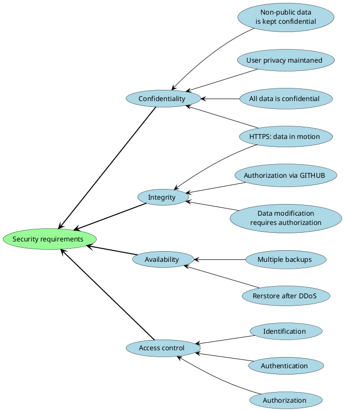
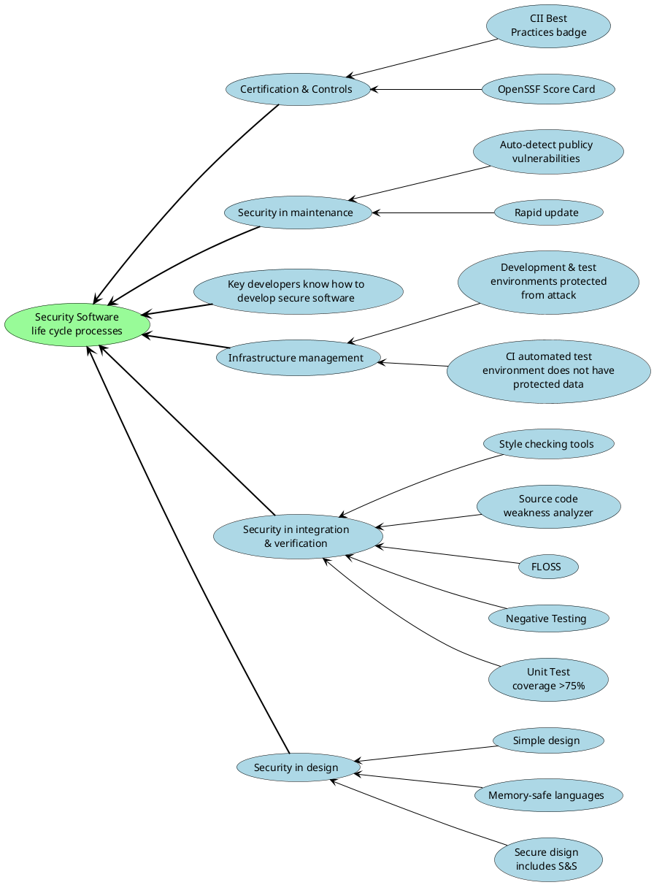

# Security Policy

## Table of Contents
1. [Introduction](#1-introduction)
2. [Vulnerabilities](#2-vulnerabilities)  
    2.1 [Supported Versions](#21-supported-versions)  
    2.2 [Vulnerability Report](#22-vulnerability-report)  
    2.3 [Security Disclosure](#23-security-disclosure)  
3. [Security requrements](#3-security_requirements)
4. [Security Software life cycle processes](#4-security-software-life-cycle-processes)

## 1. Introduction

This document outlines the procedures for addressing vulnerabilities, the supported versions of LPVS, security requirements, and the recommended practices for developing secure code.

---

## 2. Vulnerabilities

### 2.1 Supported Versions

We provide patches to address vulnerabilities for the following versions of LPVS:

| Version     | Supported by | LPVS               | 3-rd party component                           |
| ----------- | ------------ | ------------------ | ---------------------------------------------- |
| 1.0.0       | N/A          |                    |                                                |

### 2.2 Vulnerability Report

The LPVS team takes security bugs seriously and gives them the highest priority. We appreciate your responsible disclosure of security-related information to help us address vulnerabilities.

To report security bugs, please email the LPVS Security Issue Review (SIR) team at _o.kopysov@samsung.com_ with the subject line "SECURITY". Our team will acknowledge your report and aim to provide recommendations for mitigation within 1 week. Throughout the process, we will keep you informed of the progress towards the fix and may request additional information or guidance.

### 2.3 Security Disclosure

Once a security vulnerability is reported to the LPVS team, it is treated with the highest priority. The assigned person will coordinate the patch and release process, which includes the following steps:

- Confirm the problem and identify the affected versions.
- Conduct a thorough code review to identify any similar issues.
- Prepare fixes for all supported versions. The fixes will be released as soon as possible.

When disclosing vulnerabilities, we recommend following this format:

- Provide your name and email address.
- Clearly define the scope of the vulnerability and identify potential exploiters.
- Document the steps to reproduce the vulnerability to help us validate and address it effectively.
- Describe the exploitation scenario to understand the impact and severity.

We appreciate your collaboration in making LPVS more secure.

If you have any further questions or concerns, please reach out to us.

Note: This security policy is subject to change and may be updated without notice.

---

## 3. Security requrements

---

## 4. Security Software life cycle processes

---