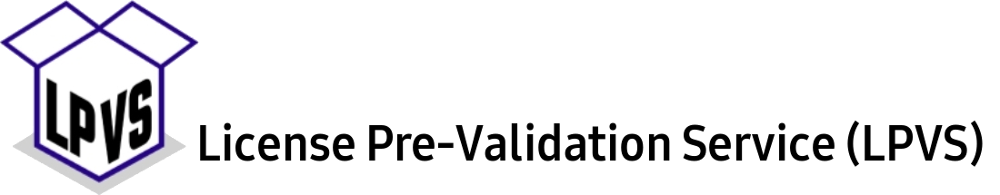

[](https://github.com/samsung/lpvs/actions?query=workflow%3ABuild)
[](https://github.com/Samsung/LPVS/actions?query=workflow%3A%22CodeQL+Analysis%22)
[](https://www.bestpractices.dev/projects/6309)
[](https://api.securityscorecards.dev/projects/github.com/Samsung/LPVS)
[](https://github.com/Samsung/LPVS/releases)
[](https://github.com/Samsung/LPVS/blob/main/LICENSE)
[](https://codecov.io/gh/Samsung/LPVS)
[](https://doi.org/10.5281/zenodo.7127519)
[](https://sourcespy.com/github/samsunglpvs/)

## Introduction
[Open-source code](https://en.wikipedia.org/wiki/Open-source_software) (that is a software that is freely available for use, study, modification, and distribution) must meet conditions of the respective license(s) of all of its dependencies. Miscompliance may lead to legal disputes, fines, obligation to disclose intellectual property, as well as reputational damage.

In projects with numerous external dependencies, it becomes challenging to track license obligations accurately. Also, when many collaborators are involved, the risk of unintentional license violations, such as through copy-pasting code snippets, increases. Furthermore, there are nuanced situations like dependencies with dual licensing or licenses that may change due to ownership, purpose, or legislative alterations. These factors can potentially turn previously safe dependencies into unsafe ones over time.

To address these license-related risks for open-source code, we have developed the _License Pre-Validation Service (LPVS)_. This tool provides a solution to mitigate potential license issues. By analyzing the project, LPVS identifies its components and their respective licenses at every commit. Then it generates a list of potential issue cases, and communicates them to the developers as comments on GitHub. LPVS offers a comprehensive description of possible license violations, including the details on the location of risky code and an overview of the specific license-related issues.

With LPVS, we aim at assisting developers and project teams with ensuring license compliance for their open-source code. By providing insights into the potential license violations and their implications, LPVS enables proactive management of license-related risks throughout the development process.

We believe that LPVS will be an invaluable tool for maintaining the integrity of open-source projects and safeguarding against license infringements.

## Features

- License Scanners:

    LPVS integrates with the [SCANOSS](https://www.scanoss.com) license scanner, allowing for comprehensive license analysis of the project's components. SCANOSS helps to identify the licenses associated with the codebase, ensuring the compliance with open-source license requirements. By leveraging SCANOSS, LPVS provides accurate and up-to-date information on the licenses used in the project.

- GitHub Review System Integration:

    LPVS seamlessly integrates with the GitHub review system, enhancing the collaboration and code review process. LPVS automatically generates comments on GitHub, highlighting potential license violations or issues within the codebase. This integration streamlines the review process, making it easier for the developers and collaborators to identify and address license-related concerns directly within the GitHub environment.

- Comprehensive Issue Description:

    LPVS provides a detailed and comprehensive description of possible license violations within the project. This includes specific information on the location of potentially risky code and an overview of the license-related issues at hand. By offering this comprehensive insight, LPVS enables the developers to have a clear understanding of license-related risks within their codebase and to take appropriate steps to mitigate them.

- Continuous Monitoring:

    LPVS facilitates continuous monitoring of license-related risks throughout the development process. By analyzing each commit, LPVS ensures that any changes or additions to the codebase are assessed for potential license violations. This ongoing monitoring allows developers to proactively manage license compliance and address any issues that arise in a timely manner.

- Risk Mitigation:

    LPVS aims at mitigating license-related risks by providing early detection and identification of potential violations. By alerting developers about potential issues and by providing the necessary information to understand and address them, LPVS empowers teams to take proactive steps to ensure compliance with open-source licenses. This helps mitigate the risk of legal disputes, financial liabilities, and reputational damage associated with license violations.

With these features, LPVS assists developers to manage license compliance for their open-source projects effectively. By integration with license scanning tools, supporting the GitHub review system, and providing comprehensive issue descriptions, LPVS offers a robust solution for identifying and addressing license-related risks in the software development lifecycle.

---

## Quick Start

### 1. Setting up your project to interact with _LPVS_

To enable _LPVS_ license scanning for your project, you need to set up GitHub Webhooks:

1. Create a personal access token (`github.token`):
   - Follow the instructions [here](https://docs.github.com/en/authentication/keeping-your-account-and-data-secure/creating-a-personal-access-token#creating-a-fine-grained-personal-access-token) to create a personal access token with the necessary permissions.

2. Configure the webhook in your GitHub repository settings:
   - Go to `Settings` -> `Webhooks`.
   - Click on `Add webhook`.
   - Fill in the `Payload URL` with: `http://<IP where LPVS is running>:7896/webhooks`.
     > If you're using ngrok, the `Payload URL` should be like `https://50be-62-205-136-206.ngrok-free.app/webhooks`.
     - Install ngrok from [here](https://ngrok.com/docs/getting-started/#step-2-install-the-ngrok-agent) (follow steps 1 and 2).
     - Run ngrok using the command: `ngrok http 7896`.
   - Specify the content type as `application/json`.
   - Fill in the `Secret` field with the passphrase: `LPVS`.
   - Save the same passphrase in `github.secret` of the LPVS backend `application.properties` or `docker-compose.yml` files.
   - Select `Let me select individual events` -> `Pull requests` (make sure only `Pull requests` is selected).
   - Set the webhook to `Active`.
   - Click `Add Webhook`.

Configuration from your project side is now complete!

Alternatively, you can use the Pull Request Single Scan API to analyze the code of a specific pull request.
Please refer to the  [API Documentation](doc/lpvs-api.yaml) for more information.

---

### 2. Using pre-built LPVS Docker images

This section explains how to download and run pre-built LPVS Docker images without building the _LPVS_ project.

For the Docker deployment scenario, you may need to fill in the environment variables in the `docker-compose.yml` file.

#### 2.1 Setting up LPVS Docker environment variables

In the case where you plan to use a database user other than `root` that reflects in files `application.properties` or `docker-compose.yml` as:
```
 spring.datasource.username=user
 spring.datasource.password=password  
```

make the following changes in the `docker-compose.yml` file in section `environment` near `MYSQL_ROOT_PASSWORD` value:

```yaml
- MYSQL_USER: user
- MYSQL_PASSWORD: password
```

If you are using only the `root` user, make the following change:

```yaml
- MYSQL_ROOT_PASSWORD: rootpassword
```

In both cases, ensure that the `MYSQL_ROOT_PASSWORD` field is filled.

You can also change the directory for storing MySQL data by modifying the following line:

```yaml
- ./mysql-lpvs-data:/var/lib/mysql # db storage by default it is a directory in the root of the repository with the name mysql-lpvs-data
```

#### 2.2 Running LPVS and MySQL Docker images with Docker Compose

Start the _LPVS_ services using `docker-compose` (before Compose V2):

```bash
docker-compose up -d
```

Start the _LPVS_ services using `docker compose` (after Compose V2):

```bash
docker compose up -d
```

Stop the _LPVS_ services using `docker-compose` (before Compose V2):

```bash
docker-compose down -v --rmi local
```

Stop the _LPVS_ services using `docker compose` (after Compose V2):

```bash
docker compose down
```

You can now create a new pull request or update an existing one with commits. LPVS will automatically start scanning and provide comments about the licenses found in the project.

---
   
## How to Build and Run _LPVS_ from Source Code

### 1. Build Prerequisites

Before building LPVS from source code, ensure that you have the following prerequisites installed:

- SCANOSS Python package by following the [guidelines](https://github.com/scanoss/scanoss.py#installation). Install it using the command:
  ```bash
  pip3 install scanoss
  ```
  Make sure that the path variable is added to the environment:
  ```bash
  export PATH="$HOME/.local/bin:$PATH"
  ```

- MySQL server installed locally. Install it using the command:
  ```bash
  sudo apt install mysql-server
  ```

### 2. Create Necessary MySQL Database and User (optional if not using a database)

2.1 Start the MySQL server:
   ```bash
   sudo service mysql start
   ```

2.2 Open the MySQL command line interface:
   ```bash
   sudo mysql
   ```

2.3 Run the following commands in the MySQL command line interface to create the necessary database and user:
   ```sql
   mysql> create database lpvs;
   mysql> create user username;
   mysql> grant all on lpvs.* to username;
   mysql> alter user username identified by 'password';
   mysql> exit;
   ```

2.4 (Optional) If you have an existing dump file, import it into the newly created database using the command:
   ```bash
   mysql -u[username] -p[password] < src/main/resources/database_dump.sql
   ```

2.5 Fill in the `licenses` and `license_conflicts` tables with the information about permitted, restricted, and prohibited licenses, as well as their compatibility specifics. You can find an example database dump file in the repository at [`src/main/resources/database_dump.sql`](src/main/resources/database_dump.sql).

2.6 Update the following lines in the [`src/main/resources/application.properties`](src/main/resources/application.properties) file:
   ```properties
   spring.datasource.username=username
   spring.datasource.password=password
   ```

### 3. Setting up _LPVS_ `application.properties`

Fill in the following lines in the [`src/main/resources/application.properties`](src/main/resources/application.properties) file:

```properties
# GitHub configuration (github.token and github.secret required)
github.token=
github.login=
github.api.url=
github.secret=LPVS
```
   > Note: For personal GitHub account use  `https://api.github.com`  in field `github.api.url=`.  
   
```text
# Used license scanner: scanoss (at the moment, only this scanner is supported)
scanner=scanoss

# Used license conflicts source:
# > option "db": take conflicts from MySQL database - 'license_conflicts' table (should be filled manually
# according to the example at 'src/main/resources/database_dump.sql')
# > option "scanner": take conflicts from the scanner response
  license_conflict=db

# DB configuration (URL, username and password) - example
...
spring.datasource.url=jdbc:mysql://localhost:3306/lpvs
spring.datasource.username=
spring.datasource.password=
```

Alternatively, you can provide the necessary values using the following environment variables: `LPVS_GITHUB_LOGIN`, `LPVS_GITHUB_TOKEN`, `LPVS_GITHUB_API_URL`, `LPVS_GITHUB_SECRET`, and `LPVS_LICENSE_CONFLICT`.

### 4. Build LPVS Application with Maven and Run it

#### 4.a Service mode (default)

To build LPVS from source code and run it in the default service mode, follow these steps:

4.a.1 Build the LPVS application using Maven:
   ```bash
   mvn clean install
   ```

4.a.2 Navigate to the target directory:
   ```bash
   cd target/
   ```

4.a.3. Run the LPVS application.

   Service is run using the following command:
   ```bash
   java -jar lpvs-*.jar
   ```

   Alternatively, you can provide the necessary values associated with GitHub and license using the command line:
   ```bash
   java -jar -Dgithub.token=<my-token> -Dgithub.secret=<my-secret> lpvs-*.jar
   ```
   > Note: Use `LPVS` as the value for the `-Dgithub.secret=` parameter.

LPVS is now built and running. You can create a new pull request or update an existing one with commits, and LPVS will automatically start scanning and provide comments about the licenses found in the project.

#### 4.b Single scan mode

Alternatively, you can perform a one-time scan on a specific pull request using the single scan mode. Follow these steps:

4.b.1. Begin by running the installation and navigating to the target directory, similar to the process in service mode (refer to steps 4.a.1 and 4.a.2):

   ```bash
   mvn clean install
   cd target/
   ```

4.b.2. Execute the single scan with the following command:

   ```bash
   java -jar -Dgithub.token=<my-token> lpvs-*.jar --github.pull.request=<PR URL>
   ```

4.b.3. By default, the above command requires a pre-configured MySQL database. To avoid setting up the database, use the "singlescan" profile:
   ```bash
   java -jar -Dspring.profiles.active=singlescan -Dgithub.token=<my-token> lpvs-*.jar --github.pull-request=<PR URL>
   ```

These steps streamline the process, allowing you to run a scan on a single pull request without the need for a preconfigured database.

4.b.4. Available option to generate an HTML report and save it in a specified folder. Replace `/path/to/your/folder` with the full path to the folder where you want to save the HTML report, and `your_report_filename.html` with the desired filename for the report.
   ```bash
   java -jar -Dgithub.token=<my-token> lpvs-*.jar --github.pull.request=<PR URL> --build.html.report=</path/to/your/folder/your_report_filename.html>
   ```

These steps streamline the process, allowing you to run a scan on a single pull request without the need for a preconfigured database.

---

## Frontend Source Code (React)

The frontend of the LPVS project is implemented using React. The corresponding code can be found in the `frontend` folder.

For detailed information about the frontend, please refer to the [Frontend README](frontend/README.md).

---

## License

The LPVS source code is distributed under the [MIT](https://opensource.org/licenses/MIT) open source license.

---

## Contributing

You are welcome to contribute to the LPVS project. Contributing is a great way to practice social coding on GitHub, learn new technologies, and enhance your public portfolio. If you would like to contribute, please follow the guidelines below:

- [How to Contribute Code](.github/CONTRIBUTING.md)
- [How to Report a Security Vulnerability](.github/SECURITY.md)
- [Code Review Requirements](doc/code-review-requirements.md)

Thank you for your interest in contributing to LPVS! Your contributions are highly appreciated.
