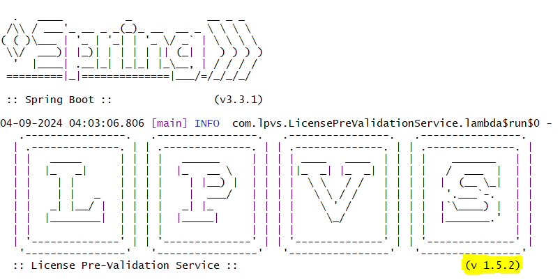

# Releases

Where to get the latest released version of LPVS.

---

## Used version

You can determine your currently used version of LPVS by running the next command in console and checking the logs:

```console
$ java -jar lpvs-x.y.z.jar
```


## Latest releases

Actual releases with release notes are available on [GitHub](https://github.com/Samsung/LPVS/releases).

## Maintenance team

The current and past members of the LPVS team.

* [@MoonkiHong](https://github.com/MoonkiHong/)
* [@tiokim](https://github.com/tiokim/)
* [@o-kopysov](https://github.com/o-kopysov/)
* [@tdrozdovsky](https://github.com/tdrozdovsky/)
* [@m-rudyk](https://github.com/m-rudyk/)
* [@v-kerimov](https://github.com/v-kerimov/)
* [@o-konoval](https://github.com/o-konoval/)
* [@t-naumenko](https://github.com/t-naumenko/)
