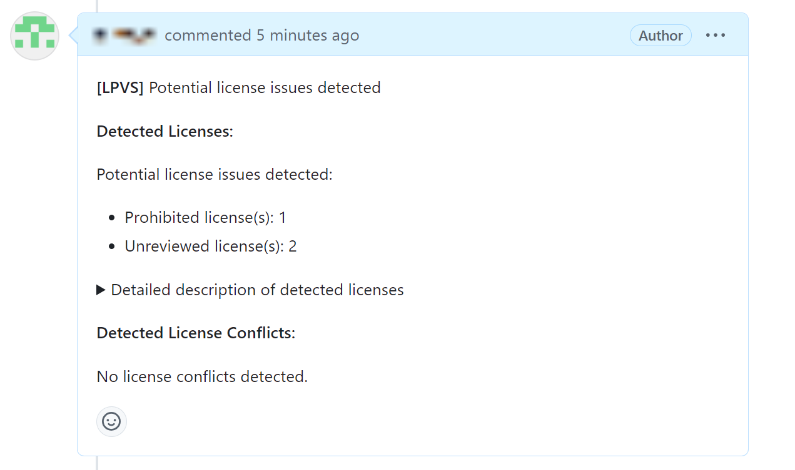

# Quick Start Guide

Minimal configuration to set up and run the LPVS service locally.

---

## Configure the repository

To enable LPVS license scanning for your repository, you need to set up GitHub Webhooks:

* Create a personal GitHub access token (`personal-token`) according to the [GitHub webhook configuration guide](user-guide/service/webhook.md#create-a-personal-github-access-token).

* Get a personal Ngrok authentication token (`auth-token`) to expose your local service on the [Ngrok portal](https://dashboard.ngrok.com/get-started/your-authtoken).

* Configure the [webhook](user-guide/service/webhook.md#configure-the-webhook-in-your-github-repository-settings) in your GitHub repository settings.

---

## Configure and run Docker images

This section explains how to download and run pre-built LPVS Docker image with ngrok reverse proxy.

### Set up LPVS Docker environment variables

* Open `docker-compose-quick.yml` file.

* In the `environment` part of `lpvs` section find and fill `github.login` and `github.token` (refer to the [guide](user-guide/service/docker.md#setting-up-lpvs-docker-environment-variables)).

```yaml
- github.login=<github-login>
- github.token=<personal-token>
```

* In the `environment` part of the `ngrok` section find and fill `auth-token` from [Ngrok portal](https://dashboard.ngrok.com/get-started/your-authtoken).

```yaml
- NGROK_AUTHTOKEN=<auth-token>
```

### Run LPVS and MySQL Docker images with `docker compose`

* Start the LPVS services:

```bash
docker compose -f docker-compose-quick.yml up -d
```

* To stop the LPVS services:

```bash
docker compose -f docker-compose-quick.yml down
```

Configuration is now completed!

## Test your pull request

You can now create a new pull request or update an existing one with new commits. 

LPVS will automatically start the scan and provide a comment about the licenses found in the project.

Example of the LPVS comment on GitHub:

{: style="height:350px"}