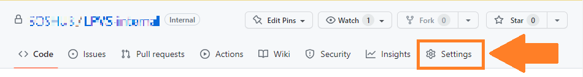
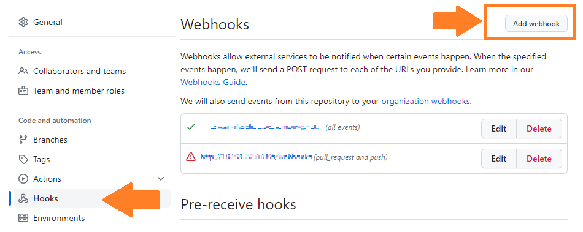
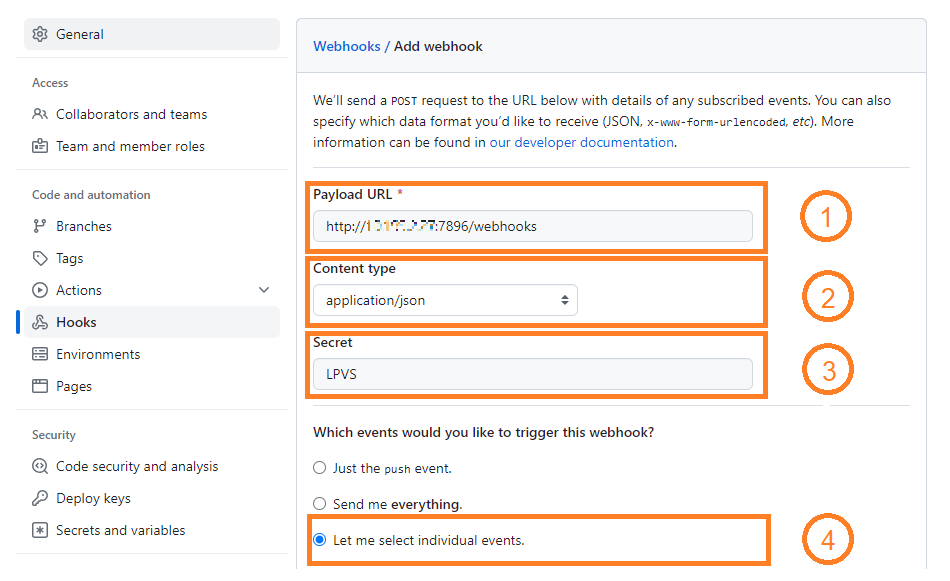
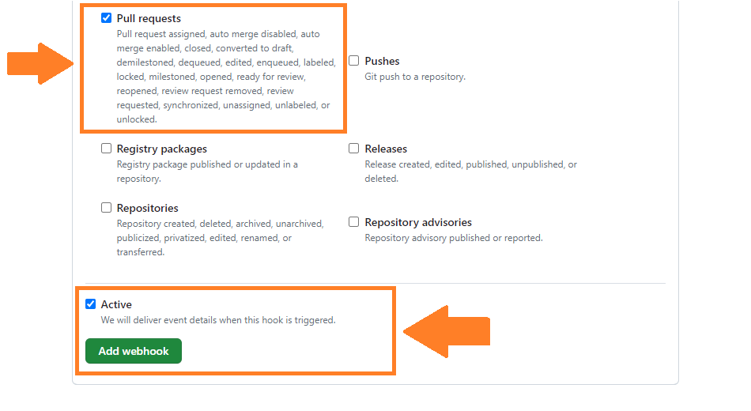

# GitHub webhook configuration

How to configure GitHub project for interaction with LPVS.

---

To enable LPVS license scanning for your project, you need to set up GitHub Webhooks:

## Create a personal GitHub access token

Follow the instructions [here](https://docs.github.com/en/authentication/keeping-your-account-and-data-secure/creating-a-personal-access-token#creating-a-fine-grained-personal-access-token) 
to create a personal access token (`personal-token`) with the necessary permissions.

!!! note

    Pay attention that the token must be copied immediately after creation, 
    because you will not be able to see it later!

---

## Configure the webhook in your GitHub repository settings

Follow the next steps:

- Go to `Settings` -> `Webhooks`.

- Click on `Add webhook`.

- Fill in the `Payload URL` with: `http://<IP where LPVS is running>:7896/webhooks`.

!!! note

    If you're using ngrok, the `Payload URL` should be like `https://50be-62-205-136-206.ngrok-free.app/webhooks`.
    
    - Install ngrok and connect your account from [here](https://ngrok.com/docs/getting-started/#step-2-install-the-ngrok-agent) (follow steps 1 and 2).
    
    - Run ngrok using the command: `ngrok http 7896`.

- Specify the content type as `application/json`.
- Fill in the `Secret` field with the passphrase: `LPVS`.
- Save the same passphrase in `github.secret` of the LPVS backend `application.properties` or `docker-compose.yml` files.

- Select `Let me select individual events` -> `Pull requests` (make sure only `Pull requests` is selected).
- Set the webhook to `Active`.
- Click `Add Webhook`.

Configuration from your project side is now completed.
